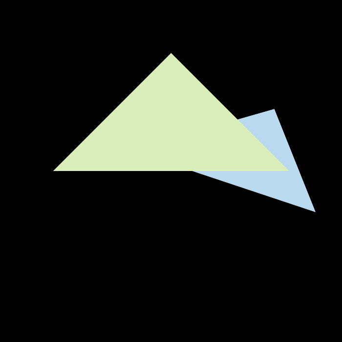

# GAME101
The assignments of GAME101 (Introduction to Computer Graphics) whose instructor is Lingqi Yan, if you are interested, please refer to [lecture website](https://sites.cs.ucsb.edu/~lingqi/teaching/games101.html) for more information. this lecture mainly includes four parts: rasterization, geometry, ray tracing and animation. (shown as the following four pictures)


## Assignment 0: Configure Assignments Environment

### Install Eigen
In the assignemnts of this lecture, Eigen is used for mathematics related calculation, such as dot product, cross product, linear transformation, projection transformation, and so on. so Eigen should be installed beforehand. If you want to know more about Eigen, please go to [Eigen website](https://eigen.tuxfamily.org/index.php?title=Main_Page) for more details. installing Eigen is straightforward. following these steps will be fine:
- Download Eigen. Go to [Eigen offical website](https://eigen.tuxfamily.org/index.php?title=Main_Page), select a latest stable version, and download it.
- Install Eigen. Upzip the package, follow the instructions in the INSTALL file which is under the root directory to install Eigen to the system path. then you can refer to Eigen header files in your code just like this:
```C++
#include<eigen3/Eigen/Core>
#include<eigen3/Eigen/Dense>
```

### Install OpenCV
To show the rendering result, We select OpenCV to do some pixel-level processing, you can go to [OpenCV Documents](https://docs.opencv.org/4.x/d0/db2/tutorial_macos_install.html), and follow these steps listed there to install OpenCV, it may take several minutes to compile the source codes, be patient! after installing OpenCV successfully, you may include the OpenCV header files and enjoy it:
```C++
#include <opencv2/opencv.hpp>
```

### Configure VSCode
On the other hand, using VSCode as our developing environment is highly recommended. the configuration corresponding to VSCode is under the .vscode directory in the root directory of every assignment. I only add the configuration for Mac OS System.(sorry about that)

After installing Eigen and OpenCV, make sure adding the include directory in the CMakeList.txt file, so that your compiler can find the header file.

```
include_directories(/usr/local/include)
include_directories(/usr/local/include/opencv4)
```

Of course, the packages should be added too.

```
find_package(OpenCV REQUIRED)
find_package(Eigen3 REQUIRED)
```

## Assignment 1: Rotation And Projection

In this assignment, we need to implement three basic transformations: rotation about Z-axis, perspective projection and rotation about arbitrary axis passing through origin.

Rotation about Z-axis is straightforward, we just apply rotation to the three basis [1, 0, 0], [0, 1, 0], [0, 0, 1], and fill the three columns of the matrix with these three new basis, then leave the four column of the matrix with translation which is [0， 0， 0].

Computing perspective projection matrix is a little tricky, there are two mistakes it's prone to make, the first one is perspective division, what x- and y-coordinate need to divide is positive z-coordinate, rather than negative z-coordinate, on the other hand, what the camera can see is the coordinate whose z-coordinate is negative, so we need to transform it to a positive one. therefore we need get a homogoneous coordinate whose w is -z after applying the projection transformation, that is to say, the four row of the transformation is [0, 0, -1, 0], instead of [0， 0， 1， 0]. the second one is correctly computing the mapping from [zNear， zFar] to [-1, 1]，we need solve this equation:
```latex
-a * zNear + b = -zNear
-a * zFar + b = zFar
```

To compute a rotation matrix about arbitrary axis passing through origin, you need only follow three steps:
- Transform to the standard orthogonal basis.
- Apply the rotation.
- Transform back.

To compute the matrix which we need to transform to the standard orthogonal basis, we need to build a new orthogonal basis, using the rotation axis as the z-axis, and calculate x-axis and y-axis, there are a lot of them, as long as x-axis, y-axis and z-axis are orthogonal to each other, and then set these three axis as the first three columns of the objective matrix. note that if a matrix is orthogornal matrix, you can calculate its inverse matrix by just transpose it which is fast.


## Assignment 2: Triangles And Z-buffering

The architecture provided by this assignment has done a lot for us. what left to us to do is just solving the visibility problem with the help of depth buffer. another problem is to judge whether a given point is in a triangle or not, which can be solved easily by calculating whether the point is all on the same side of the threes lines of the triangle using cross product.

Another point worth mentioning is how to compute the perspective-correct interpolation, although this homework has already handled this problem for us, it's worthwhile to take some time to figure out how it works. such as how the z-coordinate is correctly interpolated, and how the attributes of the vertex is interpolated. If you want to know more, you can refer to Mathematics for 3D Game Programming and Computer Graphics, Third Edition, this book gives a very elegant and easy-to-understand explanation.

SSAA(Super Sampling Anti-Aliasing) implementation is trival, a nice way is to just double the size of the frame buffer and the depth buffer, and after rasterization, down-sample the doubled frame buffer to a normal size. 

Triangle without super sampling:


Triangle with super sampling:


